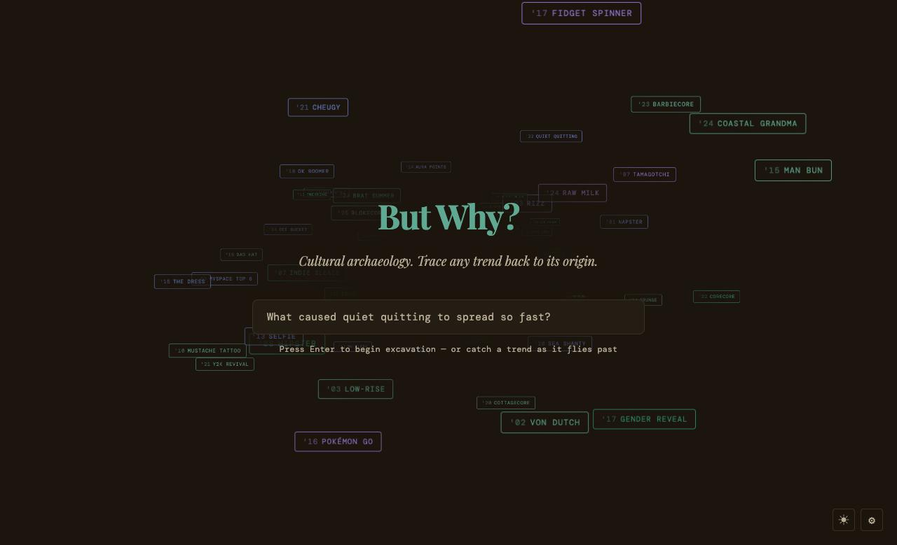
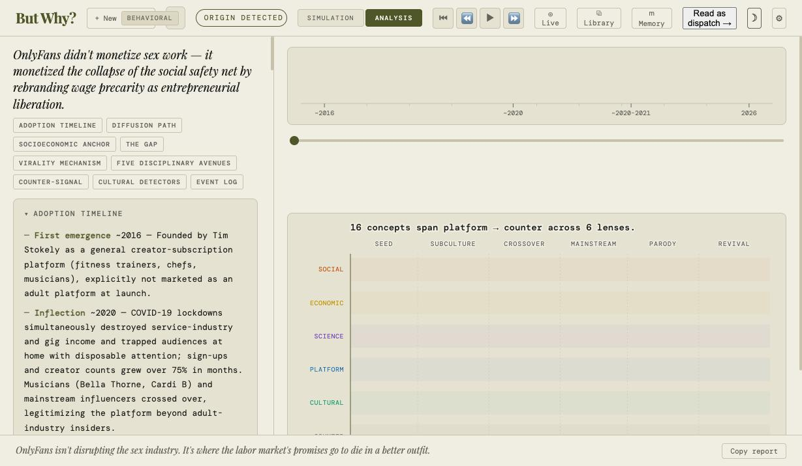
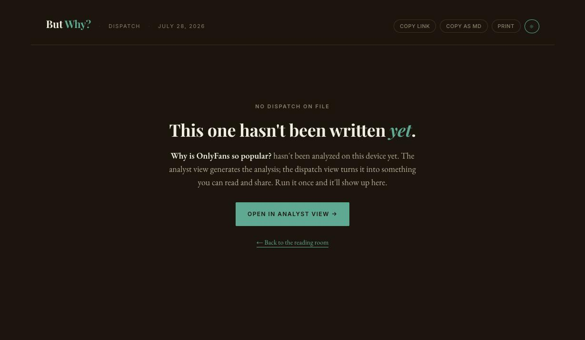

# But Why?

**A cultural archaeology engine.** Ask why a trend exists — *Why is everyone drinking raw milk? Since when is "cringe" a weapon?* — and it traces the phenomenon backward through time: when it appeared, how it spread, what socioeconomic conditions made the ground fertile, and what the trend actually signals versus what it promises.

> Formerly `sincewhen`, formerly `McWhy`. The name is the question the engine answers.



## The method

Every analysis runs the same three-move semiotic sequence:

1. **Decode the sign** — what the trend signals socially, beneath its surface content.
2. **Name the code** — the rule set producing it (platform incentives, status economies, material conditions).
3. **Expose the gap** — the distance between what the trend promises and what the system actually delivers. The gap is the strategic insight; everything else is supporting evidence.

The output is adversarial to the sign, not sympathetic to it. A flattering read means the third move didn't complete.

## Surfaces

| Surface | Path | What it does |
|---|---|---|
| **Analyst view** | `index.html` | Full excavation: adoption timeline, diffusion graph (Sankey / timeline / influence matrix), cellular-automata spread simulation, five-lens disciplinary report |
| **Dispatch** | `dispatch.html` | The same analysis re-rendered as a readable editorial brief — copy-linkable, printable, exportable as Markdown |
| **Simulator** | `cultural-simulator.html` | Standalone CA diffusion sandbox |
| **Positioning Audit** | `audit/` | Evidence-first brand-positioning pipeline (v0.1): excavate → trace → retrodict → present, every claim bound to receipt IDs |
| **Reports** | `stories/` | Long-form specimens (№001: OnlyFans) |

<p>
  
  
</p>

## Architecture

Buildless by design: vanilla HTML/CSS/JS, no bundler, no framework build step (React 18 via UMD for the simulator views only). Deployed on Netlify.

```
Browser (vanilla JS, localStorage state)
│
├─ Claude API ──────────── client-side, user-supplied key (BYOK, never leaves the browser)
├─ Netlify Functions ───── CORS proxies over public data sources (no keys server-side)
│    trends · reddit · youtube · bluesky · music · news · gdelt
│    wayback · fred · scholar · tiktok
├─ Netlify Edge Function ─ audit-analyze: streams Anthropic responses for the
│    Positioning Audit; prompts and ANTHROPIC_API_KEY live server-side only
└─ Supabase (Postgres) ─── shared library of past analyses, anon key + RLS
```

Two spend models, deliberately separate:

- **Analyst app**: bring-your-own-key. The Claude key is entered in Settings, stored in `localStorage`, and calls go browser → Anthropic directly. The deployment costs nothing to serve.
- **Positioning Audit**: server-side key via Netlify env (`ANTHROPIC_API_KEY`), because its staged prompts are the product and stay private.

## Running locally

Requires Node 22+ and the [Netlify CLI](https://docs.netlify.com/cli/get-started/).

```bash
npm install          # Netlify Functions deps only; the site itself has no build
netlify dev          # serves the site + functions at http://localhost:8888
```

Open http://localhost:8888, add a Claude API key in **Settings** (gear, bottom-right), and ask a question. Without a key, the landing page, saved analyses, and the simulator still work.

## Evidence sources

The eleven function proxies pull public signals — search interest, posts, uploads, news volume, archived pages, macro series, citations. Honest caveats:

- **Reddit** returns 403 to most datacenter egress IPs; expect empty series on some hosts.
- **Google Trends** (`google-trends-api`) intermittently gets a consent page instead of JSON.
- **GDELT** rate-limits bursts; the client staggers calls.
- **TikTok** currently proxies a third-party API; self-hosting plan in [`docs/tiktok-self-host-plan.md`](docs/tiktok-self-host-plan.md).

Failures are graceful: every proxy returns `200` with `{series: [], error}` so one dead source never blocks an excavation.

## Design system

Two-theme system, one warm world:

- **Light — parchment**: `#F0EDE2` ground, `#1A1A17` ink, olive `#4F5728` signal.
- **Dark — espresso** (Field Record): `#1B150D` ground, cream `#F2EEE4`, verdigris `#5FA891` accent.

Category pigments (signal / counter / platform / science / cultural) are fixed per theme and double as the chart legend everywhere — including the landing page, where the trend archive streams toward the viewer in 3D and any chip can be caught and excavated (pointer hit-testing runs per frame against each chip's projected rect, so the highlighted chip is always the one a click selects).

## Repository layout

```
index.html                 analyst app (single file: styles, prompts, engine)
dispatch.html              editorial view
cultural-simulator.html    CA sandbox
audit/                     positioning-audit pipeline (css/js/demo)
stories/                   long-form report specimens
sim/                       React UMD components for simulator views
netlify/functions/         data-source proxies (Node)
netlify/edge-functions/    audit-analyze (Deno, streaming)
supabase/                  schema & policies for the shared library
docs/                      plans, media
```

## Limitations

- The CA spread simulation is **illustrative, not predictive** — it visualizes a plausible diffusion regime, it does not forecast.
- Analyses are LLM-generated cultural interpretation grounded in live evidence where available; where evidence calls fail, the report says so rather than pretending.
- Library writes require the Supabase RLS policies in `supabase/`; without them the app falls back to local-only history.

## License

No license is granted. All rights reserved. This repository is source-visible for evaluation and portfolio purposes; contact [rafael.abbariao@gmail.com](mailto:rafael.abbariao@gmail.com) about any other use.
